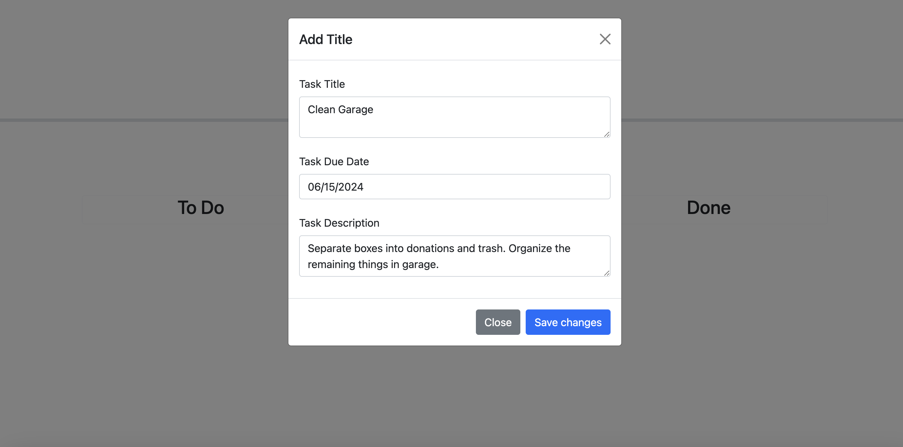
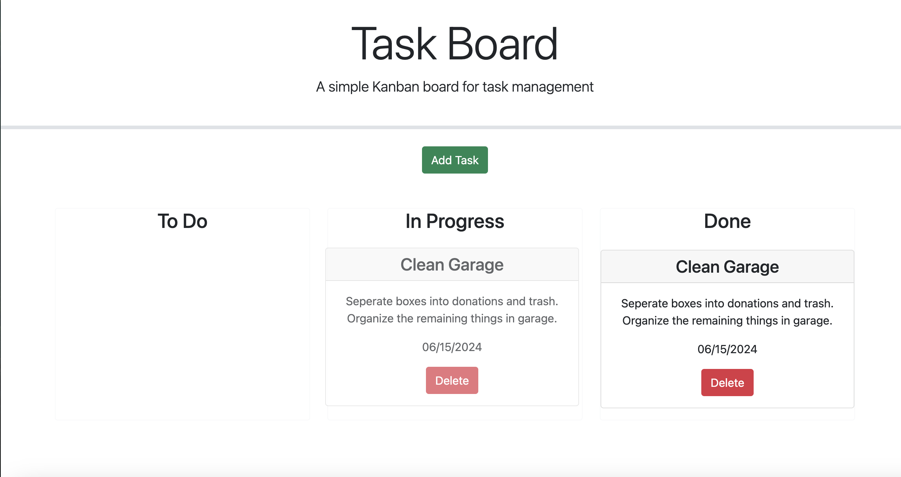
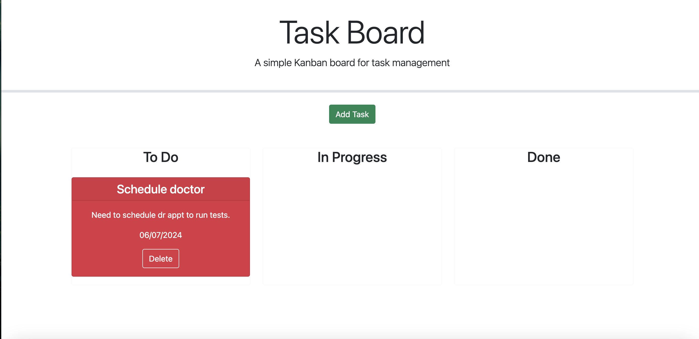
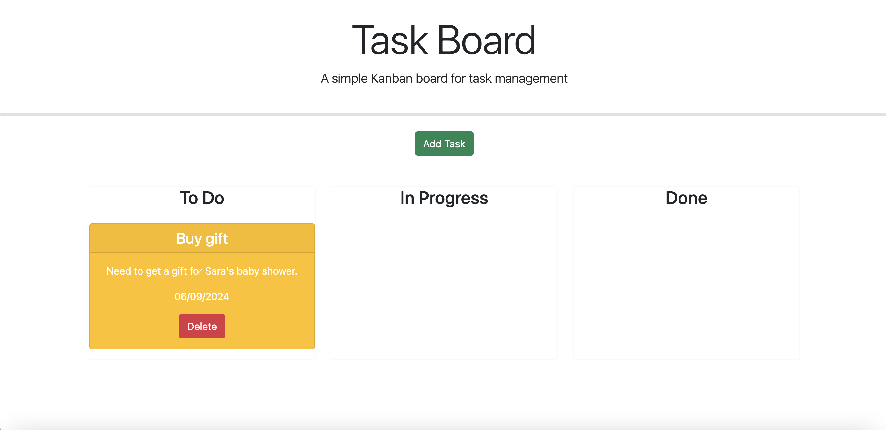

# Task Board

## User Story

```md
AS A project team member with multiple tasks to organize
I WANT a task board
SO THAT I can add individual project tasks, manage their state of progress and track overall project progress accordingly
```

## Acceptance Criteria

```md
GIVEN a task board to manage a project
WHEN I open the task board
THEN the list of project tasks is displayed in columns representing the task progress state (Not Yet Started, In Progress, Completed)
WHEN I view the task board for the project
THEN each task is color coded to indicate whether it is nearing the deadline (yellow) or is overdue (red)
WHEN I click on the button to define a new task
THEN I can enter the title, description and deadline date for the new task into a modal dialog
WHEN I click the save button for that task
THEN the properties for that task are saved in localStorage
WHEN I drag a task to a different progress column
THEN the task's progress state is updated accordingly and will stay in the new column after refreshing
WHEN I click the delete button for a task
THEN the task is removed from the task board and will not be added back after refreshing
WHEN I refresh the page
THEN the saved tasks persist
```

## Usage

When the user selects 'Add Task,' they can input a task title, due date, and description. The task will then be displayed on the page, and users can drag it to the desired column: 'To Do,' 'In Progress,' or 'Done.'






When a task is overdue, it will display red.


When a task is nearing deadline, it will display yellow.


## License

MIT License

---

© Adriana Nino. [Github Repo](https://github.com/ninadri/task-board/tree/main). [Task Board Site](https://ninadri.github.io/task-board/).
