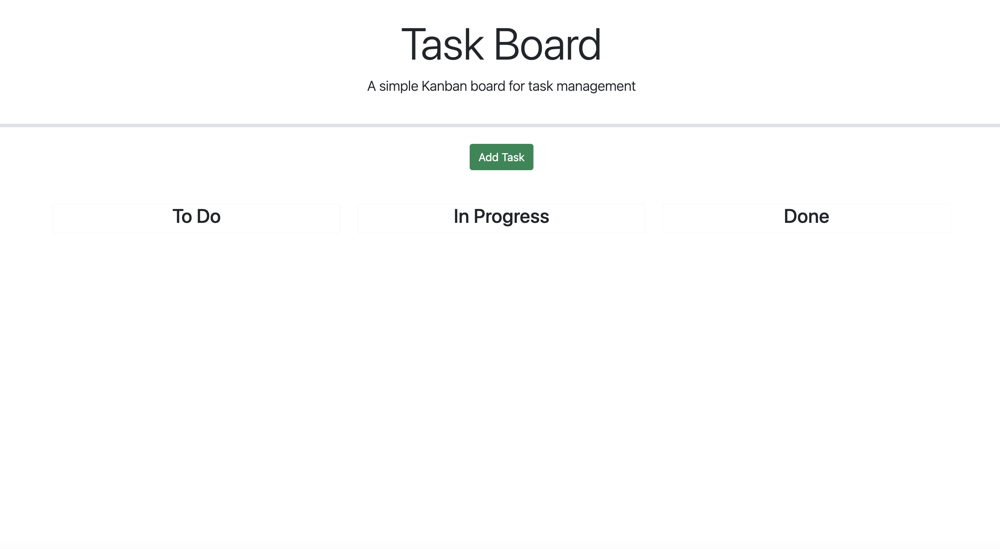
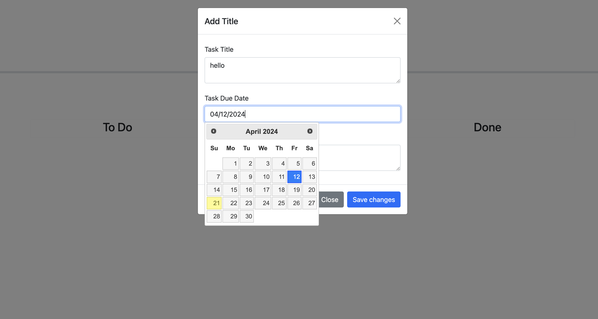
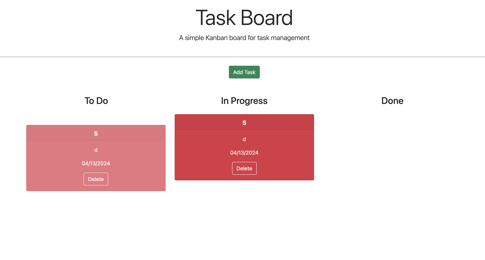

I received help from Chipo in the AskLearn is Slack. The code he gave me that fixed mine is below
" $('.lane').droppable({
  accept: '.draggable',
  drop: handleDrop 
}); "

" for (let task of tasks) {
    if (task.id === parseInt(projectId)) {
      task.status = newStatus;
    }
  }  "